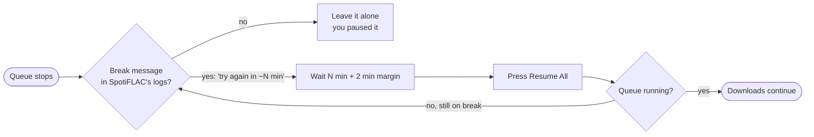

<div align="center">

# 🔁 spotiflac-autoresume

**Stop babysitting your SpotiFLAC queue.**
When a server takes its scheduled break, this waits it out and hits **Resume** for you.

[](LICENSE)


</div>

---

## The problem

SpotiFLAC's free-tier download servers take announced, scheduled breaks. When one hits, the
app stops with an error like:

```text
The server is taking a scheduled short break. Please try again in about 120 minute(s).
```

…and your queue sits there until you notice, wait, and press **Resume** by hand. Then it
happens again.

## The fix

A tiny background watcher that does exactly what you would do, at exactly the right time:



- ⏱️ **Waits the time the server announced.** No guessing a schedule, no hammering servers.
- 🪟 **Stays out of your way.** Works on a *minimized* window, never moves your mouse, hands
  keyboard focus straight back.
- 🙋 **Respects your pauses.** If you paused the queue yourself, it stays paused.
- 🚀 **Autolaunches SpotiFLAC** (minimized) if it's closed while work remains.
- 🔔 **Tray notification** when it resumes, or gives up.
- 🧰 **Easy off switch:** pause, stop, or uninstall with one command.

> [!NOTE]
> Unofficial and unaffiliated with SpotiFLAC or any music service. It only operates the app's
> own window on your PC and never contacts a download server. You are responsible for using
> SpotiFLAC and the services behind it in line with their terms and your local law.

## Quick start

**Requirements:** Windows 10/11 · Python 3.11+ on `PATH` · SpotiFLAC v7.x (tested on v7.2.2)

```powershell
git clone https://github.com/Vishnu-DRX/spotiflac-autoresume.git
cd spotiflac-autoresume
powershell -ExecutionPolicy Bypass -File scripts\install.ps1
```

That's it. The installer:

1. installs `pywinauto` (user scope, no admin),
2. creates `config.toml` from [`config.example.toml`](config.example.toml),
3. registers a per-user scheduled task that starts the watcher at every logon, hidden.

Then open `config.toml` and check `app_exe` points at your `SpotiFLAC.exe`
(only needed for autolaunch).

> [!TIP]
> **Keep SpotiFLAC open and minimized during a break.** The watcher needs the app running to
> press Resume. (If you close it, autolaunch brings it back, but a relaunch comes up with the
> queue *paused*, so leaving it open is smoother.)

## Day-to-day

**Easiest:** double-click **`menu.bat`** for a numbered menu (live status, pause/resume, press
Resume now, sync now, view/edit config, logs, start/stop, uninstall). No commands to remember.

Or from a terminal:

```powershell
scripts\autoresume.ps1 status        # is it on? what is it doing? queue + recent log lines
scripts\autoresume.ps1 watch         # same, but a live view refreshing every 2 s (Ctrl+C to exit)
scripts\autoresume.ps1 pause         # watcher stays up, takes no action
scripts\autoresume.ps1 resume        # un-pause the watcher
scripts\autoresume.ps1 resume-now    # press Resume All once, right now
scripts\autoresume.ps1 logs          # last 40 lines of watcher.log
scripts\autoresume.ps1 stop|start|restart
```

Example `status` output:

```text
● ACTIVE  watching, last check 0m 13s ago

Doing   : Server on a scheduled break: will resume at 04:32 (in 1h 55m), attempt 1/6
Sync    : off
SpotiFLAC: running   |   breaks seen: 2   |   retries: 0
Queue   : 'Vault_drx' [partial] 0 done, 392 skipped, 1 failed, 384 to go of 777

Recent  :
  2026-10-08 02:31:31 server break announced (119 min); will resume at 04:32
```

The first line is the answer to "is it on?": **● ACTIVE** (green), **◐ PAUSED** (yellow) or
**○ NOT RUNNING** (red). It's based on a heartbeat the watcher writes every cycle, so a hung
watcher shows up as not running instead of looking fine.

## Configuration

Edit `config.toml`, then `scripts\autoresume.ps1 restart`.

<details>
<summary><b>All options</b></summary>

| Key | Default | Meaning |
|---|---|---|
| `paths.app_exe` | `~\Downloads\SpotiFLAC.exe` | Used by autolaunch |
| `paths.queue_db` | `~\.spotiflac\queue.db` | SpotiFLAC's queue database |
| `watch.poll_seconds` | `60` | Queue check interval (cheap, no UI touched) |
| `watch.break_pattern` | `scheduled short break` | Text that identifies a break message |
| `watch.safety_margin_minutes` | `2` | Added to the announced wait |
| `watch.default_wait_minutes` | `30` | Used when a message has no number |
| `watch.max_retries_per_batch` | `6` | Give up after this many resumes with no progress |
| `watch.resume_unexplained_pauses` | `false` | Also resume pauses with no break in the logs |
| `watch.dry_run` | `false` | Log what would be clicked, click nothing |
| `autolaunch.enabled` | `true` | Start SpotiFLAC (minimized) if closed and work remains |
| `notify.enabled` | `true` | Tray balloon on resume / give-up |

</details>

## 🔄 Optional: playlist sync

Turn the watcher into a small sync downloader for playlists you follow. Add a track to the
playlist on Spotify and it's picked up automatically.

```toml
[sync]
enabled   = true
mode      = "interval"        # or "on_idle": sync whenever the queue goes empty
interval_hours = 6
playlists = [
    "https://open.spotify.com/playlist/xxxxxxxxxxxxxxxxxxxxxx",
]
```

Each sync re-fetches the playlist and presses **Add to Queue**. SpotiFLAC skips files it already
has, so only new tracks are downloaded. A sync only starts when nothing is downloading and no
server break is pending.

> [!WARNING]
> **Check your filename template.** "Already have it" is decided by filename. If your template
> contains the playlist position (e.g. `{track}. {title}`), a track appended at the **end** is
> fine, but a track inserted in the **middle**, or a re-ordered playlist, shifts the numbers and
> files won't match, so they'd be downloaded again as duplicates. A title/artist-based template
> avoids this.
> Sync is **add-only**: removing a track from the playlist never deletes anything on disk.

The same re-add is the watcher's last-resort fallback after a break, if pressing the row's retry
arrow doesn't restart the queue.

## How it works

SpotiFLAC v7 is a GUI-only app (no CLI or API), so the watcher uses two things:

| Need | How |
|---|---|
| Is the queue stalled? | Reads `~/.spotiflac/queue.db` (a Go *bbolt* file) read-only with a small built-in parser |
| Why did it stop? | Reads the app's **Debug Logs** page through Windows UI Automation |
| Resume it | Invokes **Resume All** on the **Queue** page (UIA invoke, no simulated mouse) |

UI sessions only happen when the queue is stalled, never while downloads run. Full write-up
with the decision loop: **[docs/how-it-works.md](docs/how-it-works.md)**.

## Uninstall

```powershell
powershell -ExecutionPolicy Bypass -File scripts\uninstall.ps1            # remove task, keep folder
powershell -ExecutionPolicy Bypass -File scripts\uninstall.ps1 -Purge     # also delete the folder
```

SpotiFLAC, its queue and your music are never touched.

## Known limitations

- **The post-break resume is the least-tested part.** Break *detection* has been verified on a real
  scheduled break (message found, wait parsed, resume scheduled). After a break the app ends the item
  as "Completed with Issues" with no *Resume All*; the watcher then presses the row's retry arrow and, if
  the queue still doesn't start, re-adds the playlist. That chain is covered by tests but its first
  live run is still pending, so please open an issue with your `watcher.log` if it misbehaves.
  See [troubleshooting](docs/troubleshooting.md).
- Relies on SpotiFLAC's UI layout (sidebar order, button names). A big redesign can break it;
  `python -m spotiflac_autoresume probe` shows what the watcher can see.
- A resume flips Windows focus to the app and back (well under a second); a keystroke typed in
  that instant can land in the wrong window.
- Windows only.

## Contributing & development

Issues and PRs are welcome, especially logs from a real break and reports from other SpotiFLAC
versions.

```powershell
python -m pip install -e ".[dev]"
python -m pytest                                          # 24 tests, no app needed
set PYTHONPATH=src && python tools\focus_check.py         # manual: proves no focus theft
```

```text
src/spotiflac_autoresume/   watcher.py (loop + decisions) · ui.py (UI Automation) · bbolt_read.py
scripts/                    install / uninstall / autoresume (PowerShell)
tests/  docs/  tools/       tests · how-it-works + troubleshooting · dev helpers
```

## License

[MIT](LICENSE) © Vishnu-DRX
